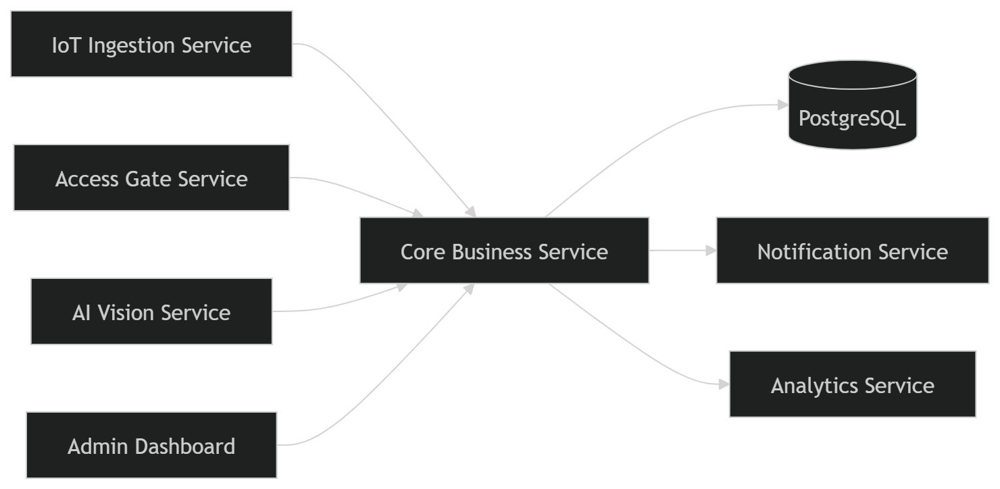

# Service Boundary của nhóm

## 1. Thông tin nhóm

- Tên nhóm: Nhóm 4
- Lớp: CNTT 17-09
- Thành viên: 4
- Service nhóm phụ trách: A6 Xây dựng dịch vụ xử lý nghiệp vụ trung tâm.
- Sản phẩm tổng thể của lớp: Hệ thống Smart Security Monitoring / Smart Building Management

## 2. Actor

Ai tương tác với hệ thống/service?
- IoT Ingestion Service
- Access Gate Service
- AI Vision Service
- Notification Service
- Analytics Service
- Quản trị viên hệ thống (Admin)
- Nhân viên bảo vệ / giám sát

## 3. System Boundary

Nhóm em xây phần nào?
- Nhóm xây dựng service trung tâm xử lý nghiệp vụ và ra quyết định cảnh báo.

Phần nhóm kiểm soát:

- Xử lý rule/policy.
- Phân tích dữ liệu sự kiện.
- Phát hiện bất thường.
- Sinh alert/cảnh báo.
- API nhận dữ liệu từ các service khác.
- Lưu lịch sử cảnh báo.
- Cung cấp dữ liệu cho Analytics.
- Kết nối Notification để gửi cảnh báo.

Phần nhóm chỉ tích hợp:

- IoT Ingestion Service.
- Access Gate Service.
- AI Vision Service.
- Notification Service.
- Analytics Service.

## 4. Service Boundary

Service của nhóm có trách nhiệm gì?
- Nhận dữ liệu từ nhiều nguồn.
- Kiểm tra dữ liệu theo rule nghiệp vụ.
- Phát hiện hành vi bất thường.
- Tạo alert tương ứng.
- Gửi cảnh báo sang Notification Service.
- Cung cấp dữ liệu cảnh báo cho Analytics.
- Ghi log và lưu lịch sử xử lý.

Service KHÔNG làm gì?
- Không điều khiển thiết bị IoT.
- Không xử lý hình ảnh AI trực tiếp.
- Không gửi email/SMS trực tiếp.
- Không quản lý người dùng.
- Không xử lý giao diện người dùng (UI).
- Không phân tích dữ liệu thống kê chuyên sâu.

## 5. Input / Output

### Input

- Dữ liệu cảm biến nhiệt độ từ IoT.
- Dữ liệu quẹt thẻ từ Access Gate.
- Kết quả nhận diện từ AI Vision.
- Rule/policy cấu hình.
- Thời gian và thông tin thiết bị.

### Output

- Alert/cảnh báo bất thường.
- Log xử lý nghiệp vụ.
- Dữ liệu tổng hợp cho Analytics.

## 6. API dự kiến

Method| Endpoint|    Mục đích
GET|	/health|	Kiểm tra trạng thái service
POST|	/events/iot|	Nhận dữ liệu IoT
POST|	/events/access|	Nhận dữ liệu Access Gate
POST|	/events/vision|	Nhận dữ liệu AI Vision
GET|	/alerts|	Lấy danh sách cảnh báo
GET|	/alerts/{id}|	Xem chi tiết cảnh báo
POST|	/rules|	Tạo rule mới
GET|	/rules|	Danh sách rule
PUT|	/rules/{id}|	Cập nhật rule
DELETE|	/rules/{id}|	Xóa rule
GET|	/analytics/events|	Cung cấp dữ liệu cho Analytics

## 7. Phụ thuộc service khác

Service này gọi đến service nào?
- Service|                	Mục đích
- Notification Service|       Gửi cảnh báo
- Analytics Service|         	Đồng bộ dữ liệu phân tích
- PostgreSQL|             	Lưu log và alert
Service nào gọi đến service này?
- IoT Ingestion Service|	Gửi dữ liệu cảm biến
- Access Gate Service|  	Gửi dữ liệu ra/vào
- AI Vision Service|    	Gửi dữ liệu nhận diện
- Admin Dashboard|      	Xem alert và rule
## 8. Sơ đồ minh họa

Có thể vẽ bằng Mermaid, draw.io, Ludichart hoặc ảnh chụp sơ đồ.

```mermaid
flowchart LR
    User[Actor] --> Service[Service của nhóm]
    Service --> DB[(Database)]
    Service --> Other[Service khác]
